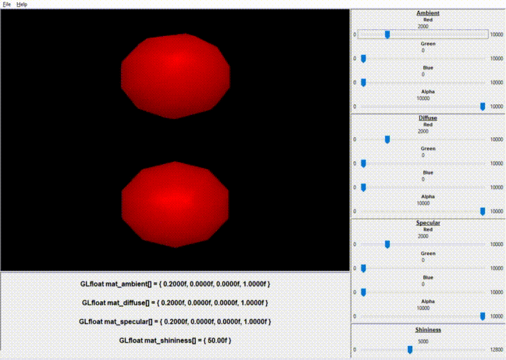

# OpenGL-Materials-Chooser

### Screenshot

### About
* This is a small project I made over a weekend while I was taking a computer graphics course. It's a little rough around the edges, but the point was to slap something together fast that I could use to pick colours for the objects I created in my course projects.
* The main reason I made this project was to be able to more easily pick colours in my graphics projects. I wanted to be able to add a little flair to my objects by choosing better colours, and this seemed the easiest way to quickly find nice looking colours.
* I also really wanted to learn a bit about building gui's in C++ with wxWidgets, so this was my first attempt using that library.
* You may notice the colours and objects look a little funny in this program. That's because we were using a deprecated method of rendering for my course, and at the time of building this project I hadn't yet learned about proper lighting and shading techniques. This program still served its purpose however.

### Disclaimer
* This was not meant to be a complete project, nor was it meant to follow any best practices. You will find that the project is lacking on comments, and includes a few hacky solutions. 

### Building this project
* You should not build this project unless you are interested in playing around with it yourself. Instead you can check out the screenshots above to see it in action!
* If you do choose to build it, I recommend building on Windows since this project was set up with Visual Studio and I do not have proper makefiles for building on linux/mac.
* To build the project, you will need to have a wxWidgets build on your computer and create a system variable called "WXWIN" that points to your wxWidgets folder. ex. C:\SDK\wxWidgets\wxWidgets-3.1.5
* Alternatively you can edit the VS project properties and replace $(WXWIN) with the path to your wxWidgets build. You will need to replace this in the C++ options and Linker options (include and library directories).
* The openGL files are all included and *should* work
* For more info on building wxWidgets, check out [this video](https://www.youtube.com/watch?v=FOIbK4bJKS8) which put me on the path of playing around with the wxWidgets library.

